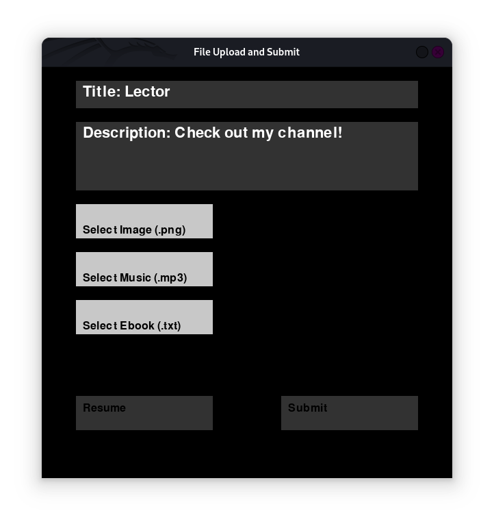

# Lector

Lector is a Python-based project that transforms text into audio and video formats, providing a unique way to experience ebooks. With Lector, you can process large text files into chapter-wise videos with background music, making it an excellent tool for audiobook and video content creation.

If you like this, you may also like [lector-subtitle](https://github.com/shamiroxs/lector-subtitle) project, which burn subtitles into videos.

---

## Run


## Audiobook
[](https://youtu.be/MlvEbSEbu8s?si=IH5zYVX14QHxLAHL)

---

## **Features**

- **GUI for File Input**: Use a Pygame-based interface to upload the required files (ebook, background music, and image).
- **Chapter Extraction**: Extracts chapters from the ebook text file while skipping the table of contents.
- **Custom Video Generation**: Combines text, background music, and an image into chapter-wise videos.
- **Video Merging**: Merges all chapter videos into a single file.
- **Chapter Details**: Generates a text file with chapter start times in `hh:mm:ss` format.
- **Clipboard Integration**: Paste text directly into the GUI using `Ctrl+V`.

---

## **Requirements**

### **Python Libraries**
Install the required libraries using pip:
```bash
pip install pygame pydub moviepy pyperclip
```

### **System Requirements**
- **SoX (Sound eXchange)**: For advanced audio effects like reverb. Install using:
  ```bash
  sudo apt install sox libsox-fmt-mp3
  ```
- A working installation of `kdialog` for file browsing (on Linux-based systems).
- Ensure `ffmpeg` is installed for handling video processing:
  ```bash
  sudo apt install ffmpeg
  ```

---

## **How to Run**

### Step 1: Prepare the Files
- **Ebook File (`full.txt`)**: Ensure the ebook is in `.txt` format and follows a structured format with chapters clearly labeled as `CHAPTER I`, `CHAPTER II`, etc.
- **Background Music (`background.mp3`)**: A `.mp3` file to serve as background audio for the videos.
- **Image (`image.png`)**: An image file to be used as the video background.

### Step 2: Execute `run.py`
Run the main script to start the GUI:
```bash
python run.py
```

### Step 3: Upload Files via GUI
1. **Title & Description**: Input the title and description of the video.
2. **File Upload**: Use the buttons to select the image, music, and ebook files. If a file is missing, the program will prompt for it.

### Step 4: Automated Processing
Once all required files are uploaded:
1. The program extracts chapters from the ebook.
2. For each chapter:
   - Background music is added.
   - The chapter content is overlaid on the image.
3. Outputs are saved as `chapterX.mp4` files in the `./chapters` folder.

### Step 5: Video Merging
After processing all chapters:
- All chapter videos are merged into a single file (`full_chapter.mp4`).
- Chapter start times are recorded in a text file (`chapter details.txt`).

---

## **File Structure**

- `input/`: Contains input files such as `full.txt`, `background.mp3`, and `image.png`.
- `chapters/`: Contains individual chapter videos (`chapterX.mp4`) and `chapter details.txt`.
- `input/full_chapter.mp4`: The final merged video.

---

## **Scripts Overview**

### **1. `run.py`**
- GUI for file selection and title/description input.
- Ensures required files are uploaded before starting the chapter processing.

### **2. `chapter.py`**
- Extracts chapters from the ebook.
- Processes each chapter sequentially, creating `chapterX.mp4` videos.

### **3. `merge.py`**
- Merges all chapter videos into a single file (`full_chapter.mp4`).

### **4. `details.py`**
- Generates a timestamp file (`chapter details.txt`) with chapter start times.

---

## **Customization**

### Reverb Effect
If you want to add a reverb effect to the background music:
- Ensure SoX is installed.
- Update `audio.py` to include a reverb step using:
  ```bash
  sox background.mp3 reverb_background.mp3 reverb 50 50 100 0.5
  ```

---

## **Limitations**
- File upload uses `kdialog`, which is Linux-specific. For cross-platform compatibility, replace `kdialog` with `tkinter` or similar file dialogs.
- ebook should be in `.txt` format
- ebook should have `Index` (with all chapters)
- each chapter should be represented as `CHAPTER` and chapter numbers in `roman letters`.
- ebook should not have special characters other than , " ' .

---

## **License**
This project is licensed under the MIT License.
